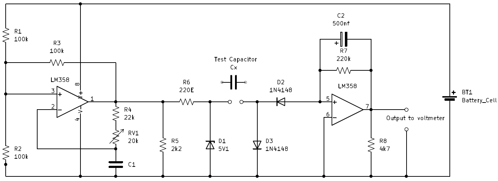
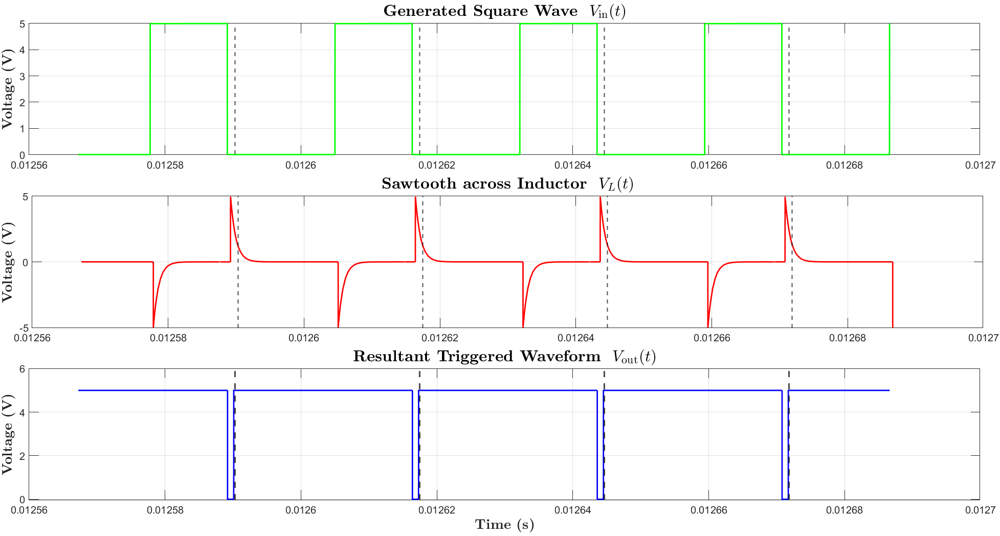
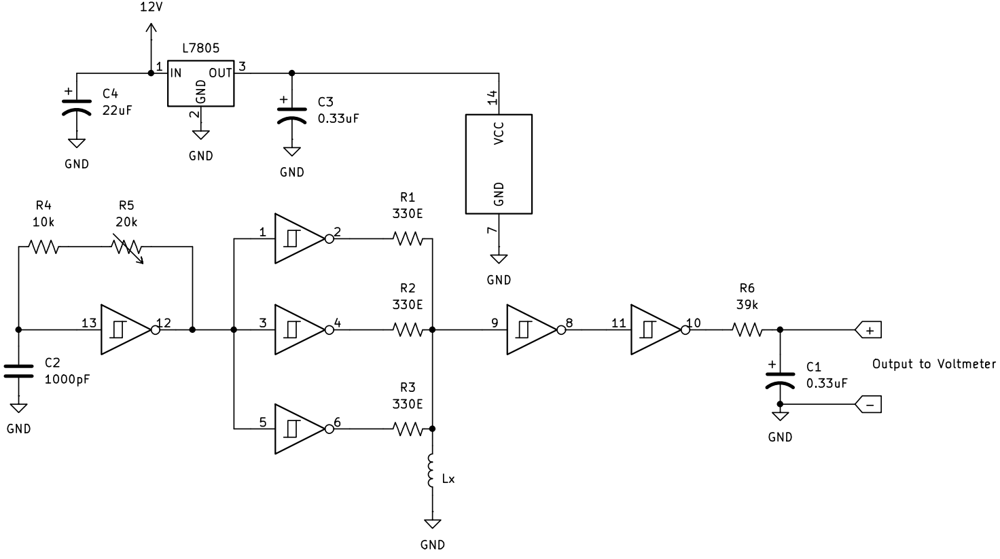
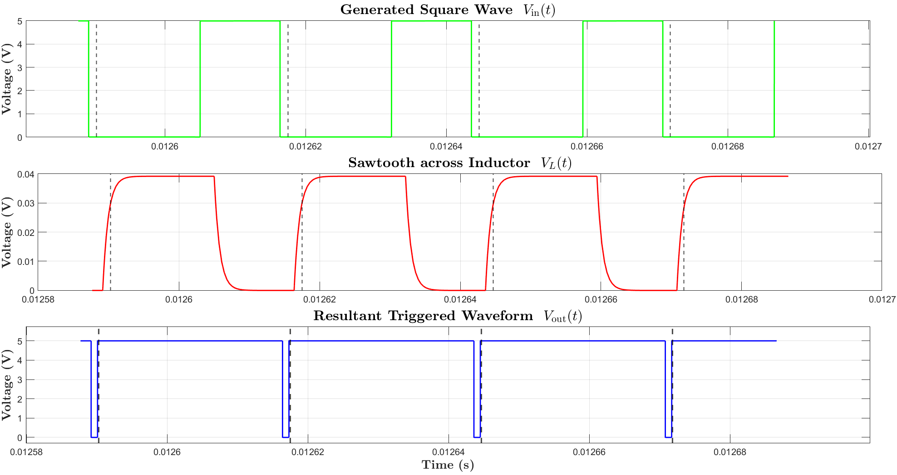
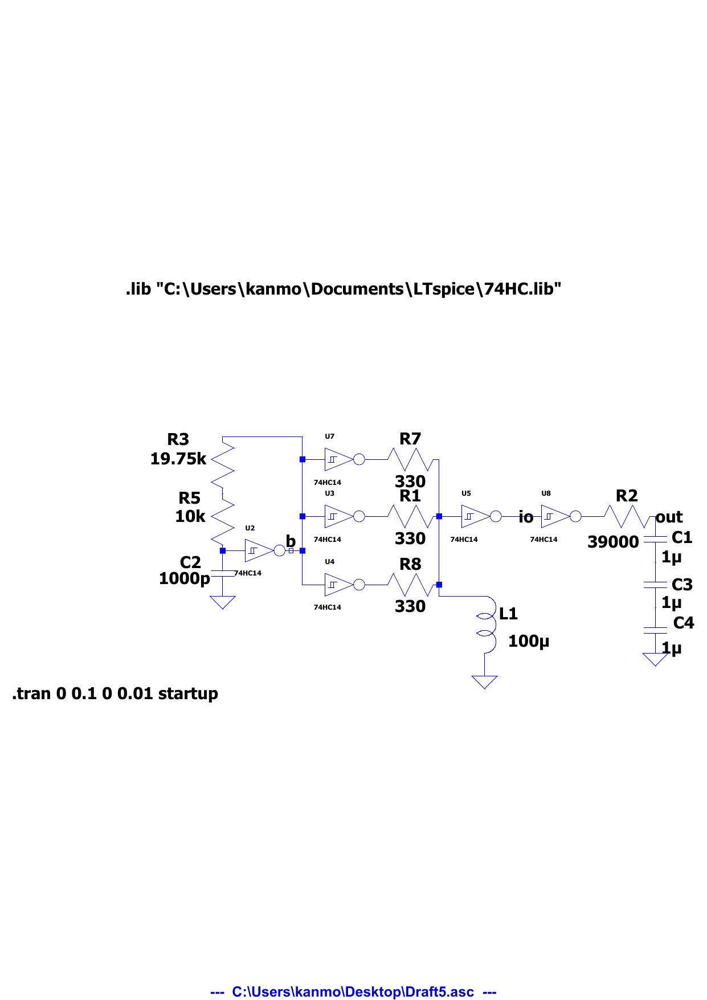
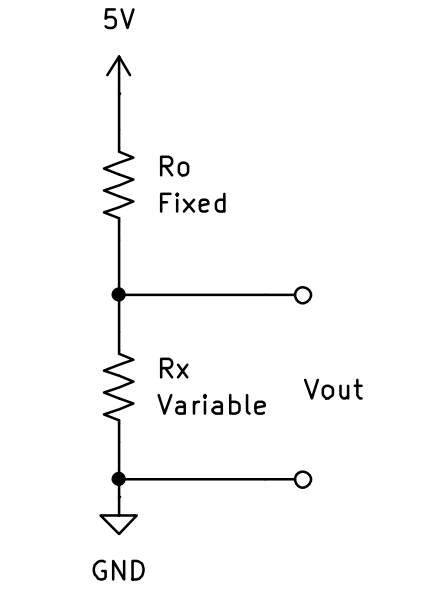
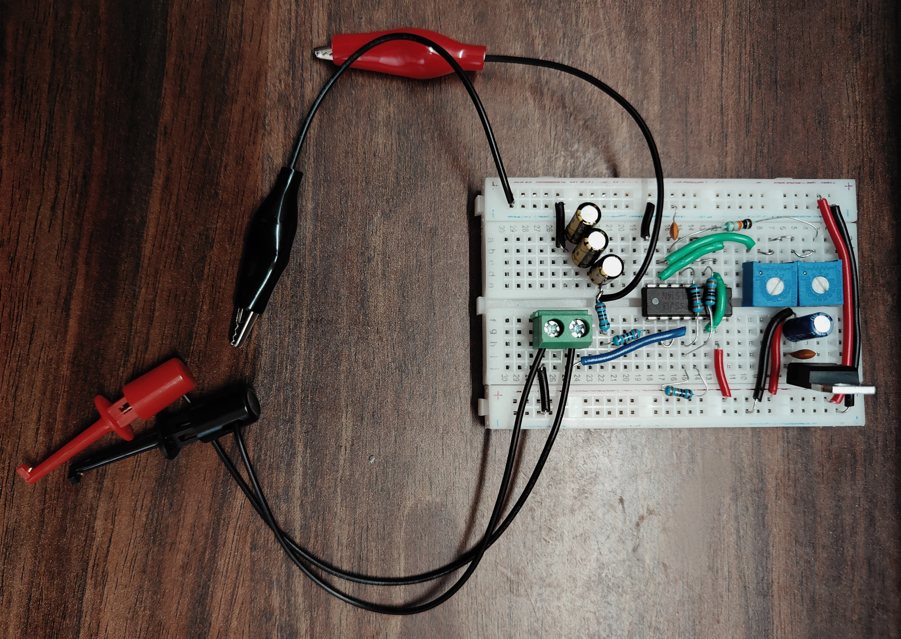
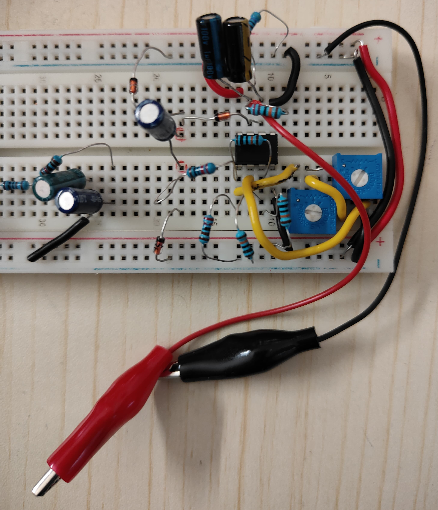

# Analog RLC Meter — Microcontroller-Free R/L/C Measurement Front-End

A fully analog, IC-based instrument that measures **resistance (100 Ω – 1 MΩ)**, **inductance (25 µH – 500 µH)**, and **capacitance (10 nF – 100 µF)** and outputs each as a proportional DC voltage readable on a standard digital multimeter — no microcontroller, no ADC, no firmware.

Built around the **LM358** (astable multivibrator + charge pump) and the **74HC14** hex Schmitt trigger (RC oscillator + pulse-width discriminator), the project applies classic analog signal-conditioning techniques — oscillator design, synchronous charge-pump linearization, pulse-width-to-voltage conversion, and precision voltage dividers — to build a three-in-one component tester validated against both **LTspice simulation** and **bench measurement**.

> Developed as part of the Analog Electronics coursework at IIT Mandi. Full write-up: [`docs/RLC_Meter_Report.pdf`](docs/RLC_Meter_Report.pdf).

---

## Why this project

Most low-cost RLC meters hide the measurement behind a microcontroller and firmware LUT, which trades transparency (and often accuracy at the extremes) for convenience. This design keeps every stage in the analog domain so each block's transfer function is derivable in closed form and independently verifiable — the kind of first-principles signal-chain reasoning that mixed-signal and analog front-end work depends on.

| Block | Technique | Output scaling |
|---|---|---|
| **Capacitance meter** | LM358 astable multivibrator → synchronous diode charge pump → transimpedance (I-to-V) stage | ≈ 10 mV / nF |
| **Inductance meter** | 74HC14 RC relaxation oscillator → RL time-constant sawtooth → Schmitt re-trigger (pulse-width mod.) → RC low-pass (PWM-to-DC) | ≈ 1 mV / µH |
| **Resistance meter** | Fixed-reference resistive voltage divider | `Rx = R₀ · Vout / (Vin − Vout)` |

---

## Results snapshot

Simulated in LTspice, then measured on a breadboard prototype with an oscilloscope and digital multimeter:

| Parameter | Reference value | Measured (DMM) | LTspice simulated | Meter output |
|---|---|---|---|---|
| Capacitance | 10 nF | 10.1 nF | 10.0 nF | 10.3 mV |
| Capacitance | 100 µF | 99.2 µF | 99.0 µF | 102 mV |
| Inductance | 100 µH | 100.1 µH | 100 µH | 102 mV |
| Inductance | 298 µH | 300 µH | 302 µH | 305 mV |
| Resistance | 10 kΩ | 9.98 kΩ | 10.0 kΩ | 2.50 V |
| Resistance | 100 Ω | 99.5 Ω | 100 Ω | 0.05 V |
| Resistance | 1 MΩ | 0.995 MΩ | 1.0 MΩ | 4.95 V |

**Demonstrated accuracy:** ±5 % (capacitance), ±8 % up to 50 µH (inductance, parasitic-limited), ±1 % near 10 kΩ (resistance).

---

## 1. Capacitance meter

The LM358's first op-amp is configured as an astable multivibrator whose frequency is set by the unknown capacitor `Cx`:

```
f = 1 / [2.2 · (R1 + RV1) · Cx]
```

A synchronous diode charge pump (D2/D3) transfers a charge packet `Cx · Vpulse` into the second op-amp every cycle; because that op-amp is wired as a transimpedance (current-to-voltage) stage with feedback resistor `R7`, the frequency term cancels algebraically and the output collapses to a signal that is **directly proportional to Cx** — independent of the oscillator's own nonlinearities. This charge-pump linearization trick is the core "analog insight" of the design.

<p align="center">
  <br>
  <sub>Fig. 1 — Capacitance meter: astable multivibrator → charge pump → I-to-V stage</sub>
</p>

<p align="center">
  <br>
  <sub>Fig. 4 — LTspice transient sim: oscillator square wave, waveform across C<sub>x</sub>, and the resulting triggered output</sub>
</p>

## 2. Inductance meter

A single 74HC14 gate (with a 20 kΩ pot, 10 kΩ resistor, 1000 pF cap) forms a relaxation oscillator at ≈100 kHz. Three parallel inverters drive the unknown inductor `Lx` through a low effective series resistance (three paralleled 330 Ω resistors, `Rs ≈ 110 Ω`) so the `L/R` time constant is large enough for the Schmitt trigger's ~10 ns switching edges not to dominate it. The resulting RL sawtooth is re-triggered into a rectangular pulse whose **width is proportional to `Lx/Rs`**, then averaged by an RC low-pass into a DC level `V_DC = K · Lx` (K ≈ 1 mV/µH).

<p align="center">
  <br>
  <sub>Fig. 2 — Inductance meter: Schmitt-trigger oscillator → RL pulse-width stage → PWM-to-DC filter</sub>
</p>

<p align="center">
  <br>
  <sub>Fig. 5 — LTspice transient sim: oscillator square wave, sawtooth across L<sub>x</sub>, and the re-triggered pulse train</sub>
</p>

The full schematic was also captured directly from LTspice for reference (component values as simulated: `R3 = 19.75 kΩ`, `R5 = 10 kΩ`, `C2 = 1000 pF`, three 330 Ω drive resistors, `Lx = 100 µH`, output RC filter `R2 = 39 kΩ` / `C ≈ 1 µF`):

<p align="center">
  <br>
  <sub>LTspice native schematic + .tran directive (74HC.lib), see <a href="ltspice/inductance_meter.asc.txt">ltspice/inductance_meter.asc.txt</a> for a re-transcribed netlist</sub>
</p>

## 3. Resistance meter

The simplest block — a straight resistive divider referenced to a known `R₀`, solved for the unknown:

```
Rx = R₀ · Vout / (Vin − Vout),   Vin = 5 V
```

<p align="center">
  <br>
  <sub>Fig. 3 — Resistance meter: reference voltage divider</sub>
</p>

---

## Hardware build

Prototyped on solderless breadboard, powered from a 5 V regulated rail (L7805), validated per-stage on an oscilloscope before combining sections.

<p align="center">
  
  <br>
  <sub>Fig. 6 (left) / Fig. 7 (right) — Inductance and capacitance meter breadboard prototypes</sub>
</p>

**Bill of materials:** LM358 dual op-amp, 74HC14 hex Schmitt trigger, L7805 5 V regulator, 1N4148 switching diodes, 5.1 V zener, precision resistors/pots, film and electrolytic capacitors, breadboard, DC bench supply, oscilloscope, digital multimeter.

---

## Repository structure

```
.
├── README.md
├── docs/
│   └── RLC_Meter_Report.pdf          # full write-up: theory, simulation, bench results, error analysis
├── ltspice/
│   ├── inductance_meter_ltspice_schematic.png   # native LTspice schematic + .tran printout
│   └── inductance_meter.asc.txt                 # re-transcribed netlist (74HC.lib, component list)
└── images/
    ├── schematics/                   # per-stage circuit diagrams (Fig. 1–3)
    ├── simulation/                   # LTspice transient waveform captures (Fig. 4–5)
    └── photos/                       # breadboard prototype photos (Fig. 6–7)
```

---

## Validation methodology

1. **Hand analysis** — closed-form transfer function derived for each stage (see equations above / report §III).
2. **SPICE simulation** — LTspice `.tran` analysis at nominal component values, confirming waveform shape and DC output scaling before any hardware was built.
3. **Bench measurement** — breadboard prototype cross-checked against a calibrated digital multimeter across the full specified range, with oscilloscope capture of the intermediate square-wave / sawtooth / pulse-train nodes to confirm each stage matched its simulated behavior.

Known accuracy limiters (documented in the report): parasitic capacitance/inductance in breadboard leads, LM358 output not reaching true ground rail (compensated with `R5` pull-down), and Schmitt-trigger rise/fall time setting a lower bound on measurable inductance.

---

## Future work

- Move from breadboard to a two-layer PCB to reduce parasitic L/C and tighten the ±8% inductance-channel error
- Add auto-ranging (switched reference resistors/gain stages) to remove manual range selection
- Characterize temperature drift of the LM358 oscillator frequency vs. output accuracy

---

## Authors

Kartik Gupta, Khushal, **Anmol Kumar**, Subham Jaiswal — B.Tech Electrical Engineering, IIT Mandi

## License

MIT — see [`LICENSE`](LICENSE) (add before publishing if you want an explicit license file).
